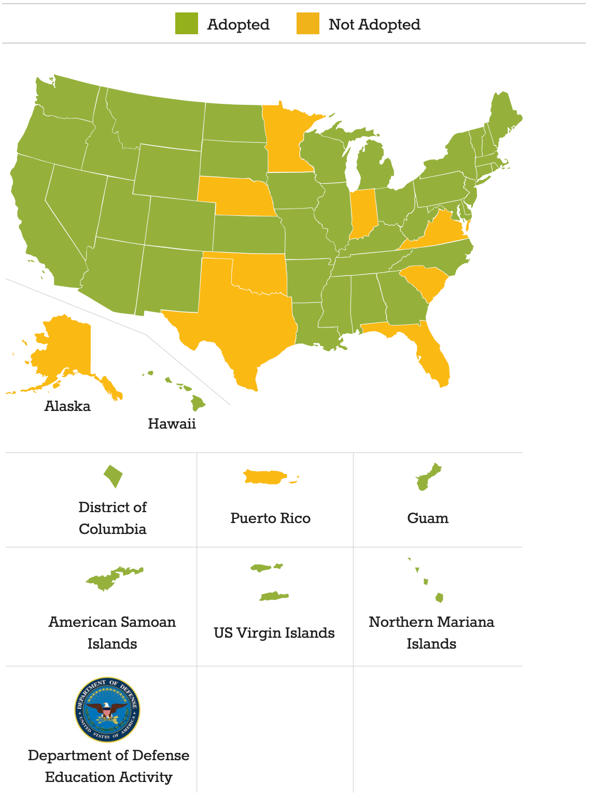
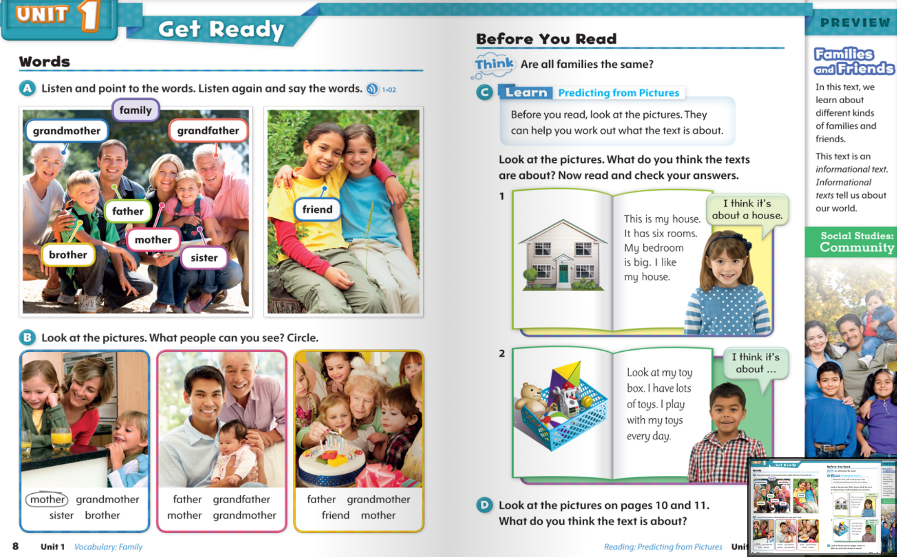
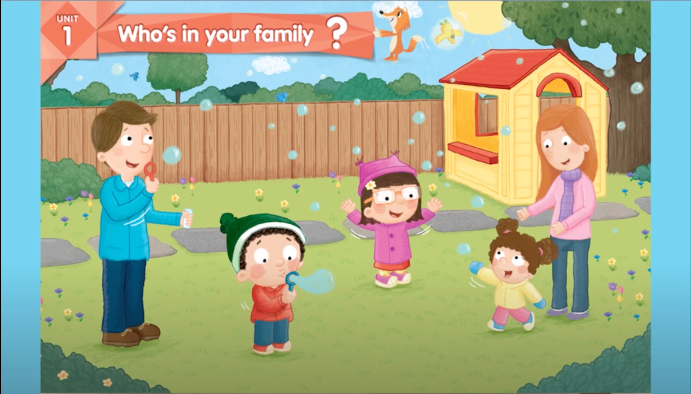
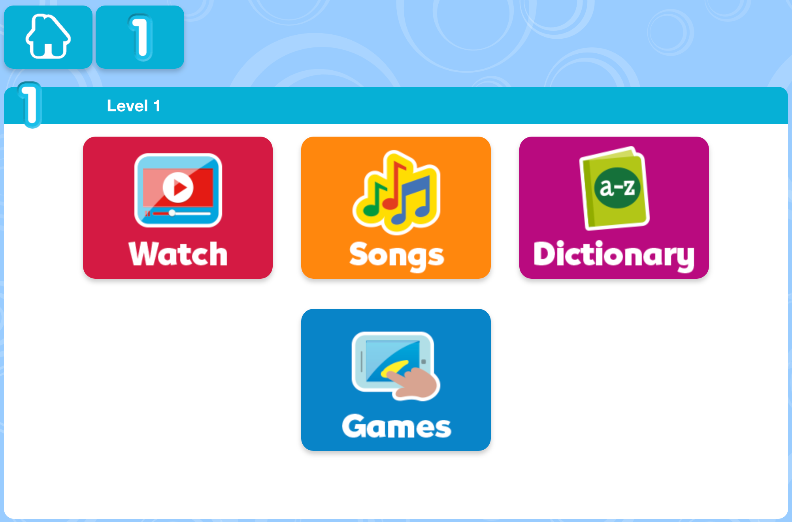

## 前言

這一系列的文章會介紹為什麼經過一番比較之後，最後選擇 TutorJr 作為兩個小朋友的線上英語學習平台，如果您也在為小朋友找適合的英語學習管道，也許會對您有些幫助。

預計這一系列文章會分為以下幾個主題來撰寫：

1. [緣起與背景](../kids-english-sharing-1)
2. [試上心得](../kids-english-sharing-2)
3. **教材內容**
4. [師資比較](../kids-english-sharing-4)
5. [顧問與客服](../kids-english-sharing-5)
6. [加值服務](../kids-english-sharing-6)
7. [價格方案](../kids-english-sharing-7)
8. [最後的提醒](../kids-english-sharing-8)

**前情提要**：上完 OiKID 的試聽課後，本來已經打算買他們家的課程了，但是老婆當天晚上在 LINE 上面問了一位之前共學教彤姐英文的老師，那位老師推薦的卻是 TutorJr，所以我又約了隔天 TutorJr 的試聽課程。試聽課結束後，小朋友對兩家線上平台的接受度都很不錯(其實我懷疑她們知道這是兩家不同的平台嗎XD)，這讓金主本人在下我又陷入了一番天人交戰，TutorJr 的師資、系統、教材都比 OiKID 好，但是貴蠻多的，到底該怎麼做抉擇才好呢？

這篇文章是系列文章的第三篇，分享一下研究 OiKid 和 TutorJr 教材內容的心得。

## 教材研究

TutorJr 試聽課隔天是星期日，本來可以好好一覺到天亮的，但是心裡有點搖擺不定，不知道到底該選 OiKID 還是 TutorJr 比較好，結果早上五點多就醒來，翻來覆去再也睡不著了，索性起床刷牙洗臉，到客廳一屁股坐下，搬出電腦開始上網做功課。

第一件事情是研究一下兩家的教材，這也是這一篇文章要分享的重點。OiKID 使用的是自家編輯，採用 CCSS美國小學課綱學程規劃的教材，外面是買不到的，所以沒有實際上課，也比較難評價這套教材的好壞；TutorJr 則是採用牛津教材，包括 Show & Tell, Let's Go, Discover 系列等等，這些教材都是外面可以自行購買，評價甚高，甚至也有一些家長採購這些教材自行教學，底下就來詳細說明這兩套教材的差異。

## CCSS美國小學課綱

OiKID 的教材其實就跟國內後來推行的「一綱多本」很類似，教育部只規定了一套統一的課綱，規範某個年級的孩子應該要有什麼樣的能力，課程主軸、核心素養、發展重點是什麼，不同的出版社，就可以根據這套課綱，編輯出版自己的教材，而 OiKID 扮演的角色，就相當於出版社。

但我其實對 CCSS 這套課綱不是那麼熟悉，上完稍微做了一下功課，原來它是 Common Core State Standards 的縮寫，網路上也找得到[官網](http://www.corestandards.org)；原本美國不同的州，教育課綱是獨立的，所以就出現了在休士頓學習的孩子，語文這門課得到 A 的成績，但搬家到加州之後，卻一下子掉到了 C (只是舉例，休士頓的朋友不要瞪我)；因為各州的課綱差異甚大，所以很難公平地評鑑孩子們的成績。

為了解決這個問題，2010 年就出現了跨州的共同課綱，也就是 CCSS (參考 [wikipedia](https://en.wikipedia.org/wiki/Common_Core_State_Standards_Initiative))。這套課綱主要是為了 K-12 的孩子設計的，也就是相當於從幼稚園到我們高中畢業的程度(從 5~6 歲的幼稚園，一路到 12 年級，也就是 17~18 歲)。

共同課綱的立意雖然良好，也不是每個州都買單，從 [CCSS 官網](http://www.corestandards.org)右上角的 "Map" 按鈕點進去，會發現目前只有 41 個州採用這套課綱制定教材：

原因也很簡單，有些教育人士認為美國地大物博，不應該讓所有孩子都學一樣的內容，以前學過大陸地理的台灣家長應該對此深有體會(我學的地理可都成了歷史了呢！)；歐巴馬任內大力推行的這套課綱，到了川普上台的時候，開始研議要廢除 - 川普曾經提過他的教育政策是"**We're cutting Common Core. We're getting rid of Common Core. We're bringing education locally.**"。雖然川普都下台了這套課綱還沒被廢除，但總覺得有點風雨飄搖的感覺，而且跟 2017 年相比又少了一個採用 CCSS 的州(參考文章：[3分鐘了解美國教育大綱Common Core覆蓋幼兒園至高中](https://kknews.cc/zh-tw/education/85z6olg.html))。

不過這並不代表 OiKID 的教材不行，畢竟這套課綱還是被大多數州所認可的；相較於課綱，我其實更在意的是教材內容不夠透明，雖然從網路上的分享來看，似乎學了一年也沒什麼大問題，但畢竟不是公開買得到的教材，很難評價它的好壞。

## OxFord Discover

TutorJr 採用的 OxFord Discover 這套教材，在網路上隨便搜尋一下都能找到好多推薦和好評：

* [思源爸爸的原版英語書單：這套教材讓小學娃通過KET，PET和FCE](https://twgreatdaily.com/FhKVS3EBfwtFQPkdqCG1.html)
* [還在糾結選哪套原版教材？選牛津Oxford Discover絕對沒錯](https://kknews.cc/zh-tw/education/k423jeq.html)
* [英语培训学校内训：培训学校不会告诉你，选择英语原版教材的依据](https://sa.sogou.com/sgsearch/sgs_tc_news.php?req=2AoYNFggqNnnYWmtWQDyIE2cV8VXEcN2FBSDOwUmw7s=&user_type=1) (簡體中文，慎入)

不管是 Show&Tell、Let's Go，還是 Discover 系列，這一系列的教材都是精心設計過，讓孩子從入門到進階的踏腳石。因為是網路上找得到的教材，敦煌書局也能買得到，所以可以[一窺堂奧](https://elt.oup.com/catalogue/items/global/young_learners/oxford_discover/?cc=tw&selLanguage=zh)，不管是從內容設計、編排、圖樣、配套的歌曲等等，都能看得出這套教材設計者的用心，難怪能夠獲得 [2015 年的 British Council 認證的 ELTons 大獎](https://www.britishcouncil.org/contact/press/eltons-2015-winners-announced)。

我也有詢問顧問，對還沒學過英語的小朋友來說，OxFord Discover 系列會不會太難？顧問解釋如果是剛入門的小朋友，會從 Show & Tell 系列開始學起，比較容易：

Youtube 上 [Show & Tell level 1 入門課程的內容](https://www.youtube.com/watch?v=blMoEMg2M9Y)

網路上能找到的[教學資源](https://elt.oup.com/parent/showandtell/?cc=tw&selLanguage=zh&mode=hub)也很豐富：

還有官網提供的[線上歌曲播放、字典、配套小遊戲](https://elt.oup.com/student/showandtell/level01/games/game-01?cc=tw&selLanguage=zh)等：

看完之後，我對 TutorJr 採用的教材還蠻放心的，至少已經可以看到內容，也找到不少配套資源，可以幫小朋友預習或複習。看完教材之後，下一步就是比較一下師資了，畢竟教材再好也是死的，還是得看老師怎麼教授，請接著看系列文章第四篇[師資比較](../kids-english-sharing-4)。
