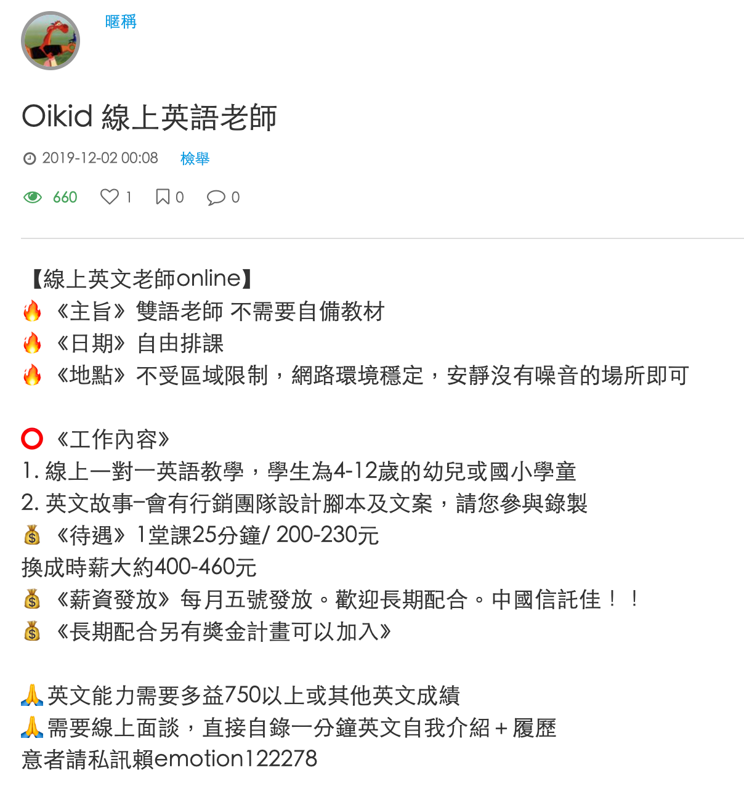

## 前言

這一系列的文章會介紹為什麼經過一番比較之後，最後選擇 TutorJr 作為兩個小朋友的線上英語學習平台，如果您也在為小朋友找適合的英語學習管道，也許會對您有些幫助。

預計這一系列文章會分為以下幾個主題來撰寫：

1. [緣起與背景](../kids-english-sharing-1)
2. [試上心得](../kids-english-sharing-2)
3. [教材內容](../kids-english-sharing-3)
4. **師資比較**
5. [顧問與客服](../kids-english-sharing-5)
6. [加值服務](../kids-english-sharing-6)
7. [價格方案](../kids-english-sharing-7)
8. [最後的提醒](../kids-english-sharing-8)

**前情提要**：上完 OiKID 的試聽課後，本來已經打算買他們家的課程了，但是老婆當天晚上在 LINE 上面問了一位之前共學教彤姐英文的老師，那位老師推薦的卻是 TutorJr，所以我又約了隔天 TutorJr 的試聽課程。試聽課結束後，小朋友對兩家線上平台的接受度都很不錯(其實我懷疑她們知道這是兩家不同的平台嗎XD)，這讓金主本人在下我又陷入了一番天人交戰，TutorJr 的師資、系統、教材都比 OiKID 好，但是貴蠻多的，到底該怎麼做抉擇才好呢？

這篇文章是系列文章的第三篇，分享一下比較 OiKid 和 TutorJr 師資陣容的心得。

## 外師 v.s. 中師

因為我在外商工作，所以有機會接觸到一些同事，很小的時候就跟著爸媽移民到美國去，後來因緣際會又回到台灣外商工作(有些只是短期的)；跟他們聊天的時候，有些同事的口音非常美式，完全聽不出是台灣口音，就順著聊到 non-native speakers 英語口音的問題，雖然還沒有科學研究證實，但根據他們的經驗分享，如果孩子年紀比較大(7 ~ 8 歲)之後才開始接觸英語，通常口音會比較重，也比較容易聽得出來他們不是 native speakers。有一位同事的案例很有趣，他和他哥哥小時候一起移民到美國，但那時候他才 6 歲，而他哥哥已經 9 歲了，結果他們在一樣的環境底下學英文，他的口音是超級純正的美式發音，但他哥哥卻一聽就知道不是 native speaker (雖然跟我們比當然還是好很多，哈)。

當然也有人說口音不是最重要的，很多印度裔的 CEO 就算講話口音很重，在美國矽谷還不是表現得很好；但如果他們的口音更為純正，是不是能表現得更好呢？至少對我來說，平常跟不同國籍的同事工作，深有體會口音對溝通的影響(跟印度同事開會通常只能聽懂六成);如果能讓孩子早點接觸英語，從小就開始訓練純正的美式英語，何樂而不為？

兒童英語我覺得是一個很重要的啟蒙階段，如果能及早讓孩子接觸美式口音，讓她們早點模仿外師的發音方式，當然是比較好的；不過在孩子剛接觸線上課程的時候，我覺得有精通雙語的中師幫忙帶入門也很重要，尤其是我家菲妹只有三歲半，對陌生老師的接受度其實還不是那麼高，中師能講中文幫忙安撫和誘導她上課，這一點是有加分的。

## OiKid

先從 OiKid 的師資說起，結束試聽之後，我向聯繫我的顧問詢問了一下，目前 OiKid 的外師跟中師比例為多少？顧問一開始遲疑了一下，但後來很坦白地跟我說，目前中師比較多，佔大約七成；但也有一些外師，比例大約是三成。

這個比例其實會讓我有點疑慮，擔心會不會預約不到好的外師，尤其從網路上其他家長的分享來看，好的外師要自己去搶，在跨過啟蒙階段，孩子開始熟悉線上英語教學之後，會不會只剩下中師可選？當然不是說中師不好，端看自己的目標是什麼；像我讓孩子從小學英文的目的之一，就是要讓她們及早接觸純正的美式發音，能多聽外師的口音當然是比較好的。

試聽完隔天早上，因為睡不著，所以早早就上網做功課，想了想，在沒有報名課程的情況下，該如何知道這家公司的師資水準如何呢？一開始有點苦惱，畢竟沒辦法真的登入去看一下有哪些老師可以預約；但後來換個角度想，何不去看一下這家公司都是怎麼聘請老師的呢？結果還真的被我發現了一些端倪。

在網路上換個關鍵字搜尋之後，找到了 2019 年 12 月一篇 [OiKid 求才的文章](https://www.blink.com.tw/board/post/79729/)：
從這篇文章來看，很明顯是徵求中師的，從這篇徵才文可以看出幾件事情：

1. 從待遇來看，我可以想像很多應徵者會是還在唸書的大學生或研究生，來這裡打工賺點外快
2. 應徵內容以獎金來鼓勵求職者長期配合，顯然目前大部分老師都是短期的(否則就不需要特別獎勵了)
3. 對專業能力的要求只有 TOEIC 750 分以上，似乎不是特別高的標準！？

再對照一下 OiKid 的[官網師資頁面](https://www.oikid.com/pageTeacher.html)

總讓我覺得落差有點大，不太放心的感覺。

從[徵求外師的要求](https://oetjobs.com/online-esl-school/oikid-job-application/)來看，也沒有規定一定要有什麼證照，只要是大學以上畢業的 native speakers 就可以了：

OiKid [徵求外師的官網](https://oikid-t.weebly.com/join-oikid.html)也相對簡陋，如果我是外師想 join 都沒辦法：

## TutorJr

看完 OiKid 的徵才網站及貼文後，讓我對 OiKid 的師資水準相當懷疑。接著再來看看 TutorJr 在這方面做得又是如何？

TutorJr 隸屬於 iTutorGroup 底下（iTutorGroup 集團旗下擁有英語教學 TutorABC、tutorJr、vipabc、vipjr，及教授華語的 TutorMing 共五個品牌），根據一家外國分享線上英語教學求職機會的[網站](https://oetjobs.com/online-esl-school/oikid-job-application/)，TutorJr 對老師的要求有兩點跟 OiKid 是一樣的：必須是 native speakers，以及大學以上學歷；但 TutorJr 還多要求了兩點：

1. **必須**要有專業教學執照(TEFL, TESOL, CELTA等)
2. **必須**有教學經驗

再來看看 TutorJr 母公司 iTutorGroup [官網](https://join.itutorgroup.com/#/?partner=Oakary&fromwhere=Oakary)對老師的要求：

看完師資應徵的環節之後，讓我對 OiKid 打上了一個大大的問號，如果徵求老師都不用心，要我怎麼相信師資水準是很堅強的！？這點也是讓我心中的天秤倒向 TutorJr 的關鍵。

看完這篇文章，有興趣的朋友可以接著往下看系列文章第五篇[顧問與客服](../kids-english-sharing-5)。
