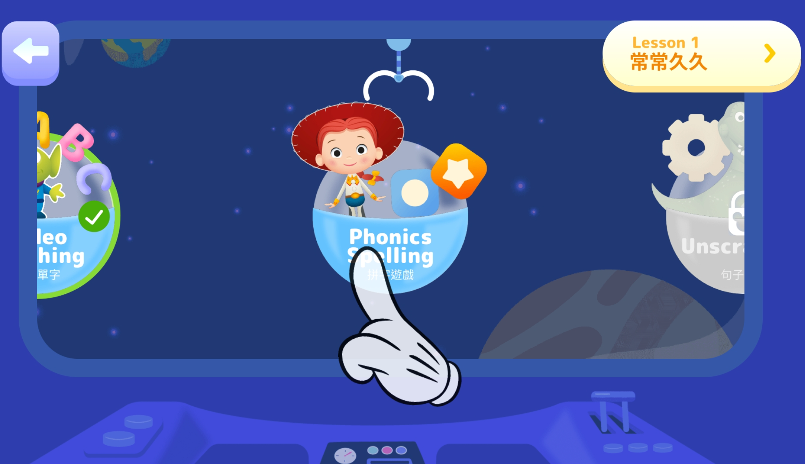

## 前言

這一系列的文章會介紹為什麼經過一番比較之後，最後選擇 TutorJr 作為兩個小朋友的線上英語學習平台，如果您也在為小朋友找適合的英語學習管道，也許會對您有些幫助。

預計這一系列文章會分為以下幾個主題來撰寫：

1. [緣起與背景](../kids-english-sharing-1)
2. [試上心得](../kids-english-sharing-2)
3. [教材內容](../kids-english-sharing-3)
4. [師資比較](../kids-english-sharing-4)
5. [顧問與客服](../kids-english-sharing-5)
6. **加值服務**
7. [價格方案](../kids-english-sharing-7)
8. [最後的提醒](../kids-english-sharing-8)

**前情提要**：上完 OiKID 的試聽課後，本來已經打算買他們家的課程了，但是老婆當天晚上在 LINE 上面問了一位之前共學教彤姐英文的老師，那位老師推薦的卻是 TutorJr，所以我又約了隔天 TutorJr 的試聽課程。試聽課結束後，小朋友對兩家線上平台的接受度都很不錯(其實我懷疑她們知道這是兩家不同的平台嗎XD)，這讓金主本人在下我又陷入了一番天人交戰，TutorJr 的師資、系統、教材都比 OiKID 好，但是貴蠻多的，到底該怎麼做抉擇才好呢？

這篇文章是系列文章的第六篇，分享一下 TutorJr 的加值服務的部分。沒有 OiKid 的加值服務分享，是因為在試聽過程中以及查看他們家官網，我沒有發現什麼值得分享的加值服務。

## 線上英文故事繪本

登入 TutorJr 的學習帳號之後，我發現他們家竟然英文故事繪本可供線上觀看，並且還有配套語音播放的功能：

重點是，他們家的故事繪本是和大名鼎鼎的 Highlights Library 合作的，這套繪本每一頁都有精美插圖，而且有分級，可以自行篩選不同的年齡和主題，根據小朋友的程度自行決定該唸哪一本比較好；加上每本繪本都有語音，在觀看的時候會自動播放，我可以偷懶只念她們聽不清楚，或是重要的字，跟小朋友一起共讀就更輕鬆了！

國內的敦煌書局也有跟 Highlight Library 合作，推出[美國Highlights雲學院](https://cavesfamily.cavesbooks.com.tw/event/%E7%BE%8E%E5%9C%8Bhighlights%E9%9B%B2%E5%AD%B8%E9%99%A2/#about)，之前做完功課差點衝動購物；還好當時忍住了，因為只要加入 TutorJr 就可以有一樣的服務了！好啦，其實還是不太一樣，跟原裝的 Highlights Library 比起來，TutorJr 提供的版本少了閱讀歷程跟讀後測驗這兩個部分，是比較可惜的，希望他們之後也能跟上。

## iOS/Andriod App

TutorJr 在兩個平台上都提供了自家的 App，可以透過 App 訂課、查詢課程、複習上過的課等等，不需要透過瀏覽器登入使用，還是很方便；另外比較特別的是，還有家長專用的 app，可以在孩子上課的時候，透過家長專用 app 遠端即時觀察孩子的上課情況，不會被孩子發現。

另外上述提到的學習資源，也都整合到了 App 裡，使用上也很方便。

### 童話學英文

在 App 裡還多了一項功能是網頁版沒有的，就是「童話學英文」，雖然目前數量還不多，但多了一項選擇，讓孩子可以一邊聽英文童話故事，一邊熟悉英語語感；比較特別的是，這些故事不是常見的童話故事，應該是 TutorJr 自己編輯上傳的。

### 單字測驗小遊戲

另外 App 裡還有一些蠻有趣的小遊戲，可以在遊戲中複習單字，還有練習怎麼拼字等，在孩子在遊戲中學英文：

## 魔法玩具城

不知道從什麼時候開始，幼教事業都很喜歡用發放點數的方式獎勵小朋友，再用點數換自己想要的禮品，老實說，小朋友是蠻吃這一套的，至少我家這兩隻動不動就要我打開看一下有什麼獎品可以換(汗)；TutorJr 也不例外，但他們家比較不一樣的是，提供的獎品有點豪華，甚至還有 iPad 可以換！

獲得點數的方式也很簡單，只要上課專心，老師看情況會給星星，一顆星星可以兌換為一百顆魔法石，再用魔法石換獎品；其他獲得魔法石的方式，還有幫老師做課後評鑑、完成課後作業等。

## 現場免費活動

一開始的時候沒注意到，不過 TutorJr 其實會舉辦不定期的活動，最近疫情比較穩定下來，萬聖節舉辦了吼野狼的活動，鼓勵小朋友變裝後帶著一些跟萬聖節有關的小道具到現場，跟其他小朋友還有老師一起互動學英文。活動過程會發放一些小獎品，不過最特別的，是活動結束後，可以從 TutorABC 大樓三層樓高的溜滑梯溜下來！不過身高限制 120 公分以上才能玩，所以要注意一下喔。

看完加值服務，接下來就來比較一下 OiKid 和 TutorJr 的[價格方案](../kids-english-sharing-7)吧！
