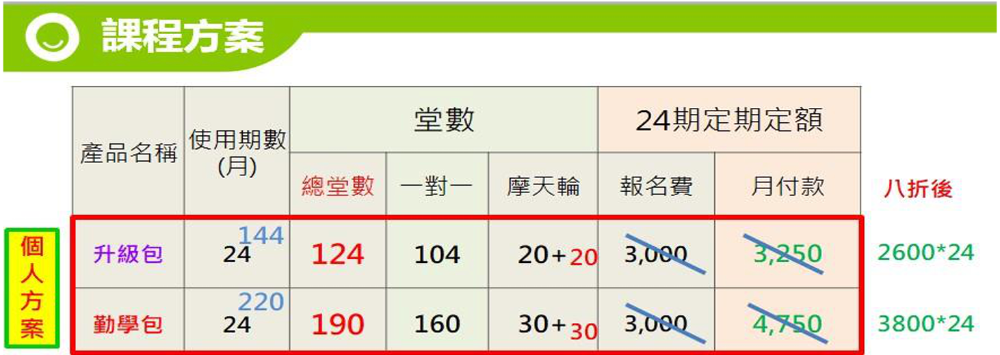
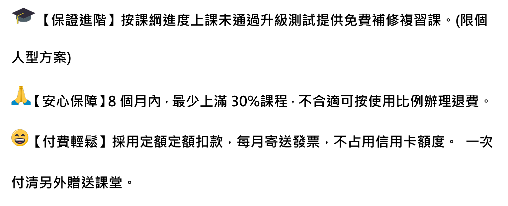
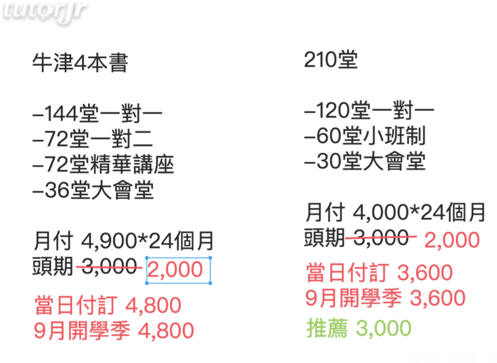
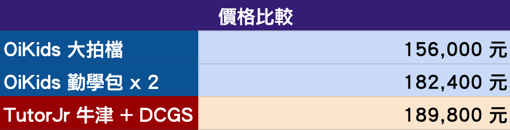

## 前言

這一系列的文章會介紹為什麼經過一番比較之後，最後選擇 TutorJr 作為兩個小朋友的線上英語學習平台，如果您也在為小朋友找適合的英語學習管道，也許會對您有些幫助。

預計這一系列文章會分為以下幾個主題來撰寫：

1. [緣起與背景](../kids-english-sharing-1)
2. [試上心得](../kids-english-sharing-2)
3. [教材內容](../kids-english-sharing-3)
4. [師資比較](../kids-english-sharing-4)
5. [顧問與客服](../kids-english-sharing-5)
6. [加值服務](../kids-english-sharing-6)
7. **價格方案**
8. [最後的提醒](../kids-english-sharing-8)

**前情提要**：上完 OiKID 的試聽課後，本來已經打算買他們家的課程了，但是老婆當天晚上在 LINE 上面問了一位之前共學教彤姐英文的老師，那位老師推薦的卻是 TutorJr，所以我又約了隔天 TutorJr 的試聽課程。試聽課結束後，小朋友對兩家線上平台的接受度都很不錯(其實我懷疑她們知道這是兩家不同的平台嗎XD)，這讓金主本人在下我又陷入了一番天人交戰，TutorJr 的師資、系統、教材都比 OiKID 好，但是貴蠻多的，到底該怎麼做抉擇才好呢？

這篇文章是系列文章的第七篇，分享一下關於 OiKid 和 TutorJr 價格方案的部分。

## OiKid 價格

先來看一下 OiKid 的部分，這是顧問給我的報價單：

試聽當天報名有好禮三選二：

我會選學費八折優惠，個人方案八折優惠後的價格如下：

圖中的「摩天輪」就是多人一起上課的課堂。

至於家庭方案八折後則是：

### OiKid 退費

OiKid 保證八個月內，如果上滿了 30% 課程但真的覺得不適合，可以退費：

另外第一條條款也很特殊，OiKid 規定小朋友上完一定堂數後，要參加升級考試，通過才可以晉升下一級，如果沒通過的話，之後預約的一對一課程不會扣堂數，直到分級考試通過為止；不過所有的堂數還是得在兩年內用完，所以這條對我來說還好，如果可以遞延使用期限的話會比較有幫助。

## TutorJr 價格

彤姐跟菲妹上的課程不一樣，彤姐上的是牛津課程，而菲妹上的是專屬一對一客製化教學，所以我把兩種價格方案貼在底下，左邊是牛津課程的費用，右邊則是菲妹的一對一課程：

### TutorJr 退費

* 購買兩週內，如果使用堂數沒有**超過 8 堂**，可以全額退費
* 課程時間或使用堂數沒有超過三分之一，可以退還總額 50%
* 課程時間或使用堂數超過三分之一，就無法退款了

扣掉所有優惠跟折扣後，我做了一張簡單的表格比較 OiKid 和 TutorJr 的總費用和上課堂數：

最後看了一下，其實兩者的價差沒有想像中那麼大：

比較完價格之後，心裡已經有預期 TutorJr 的費用會比較貴了，但老實說，OiKid 的價格也沒有我想像中那麼便宜；不知道各位朋友是不是有跟我一樣的感覺？

講完了價格比較的部分，終於要來到系列文章的最後一篇了，別忘了要看[最後的提醒](../kids-english-sharing-8)喔！ 
